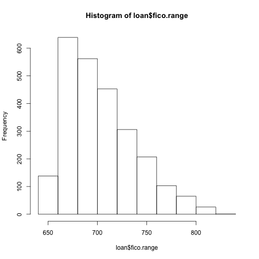
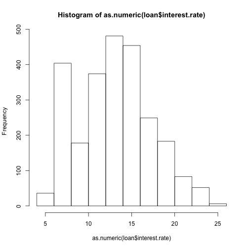
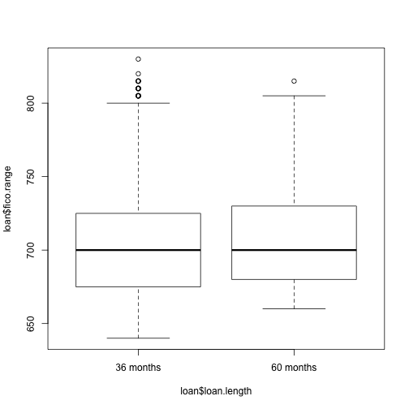
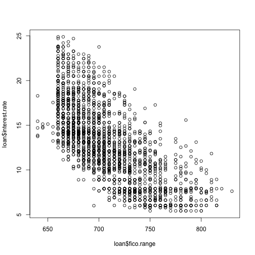
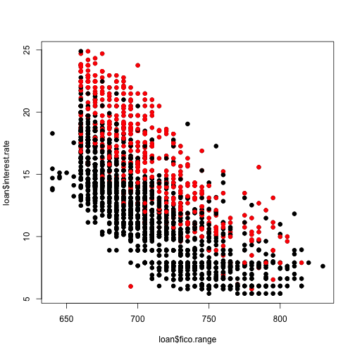
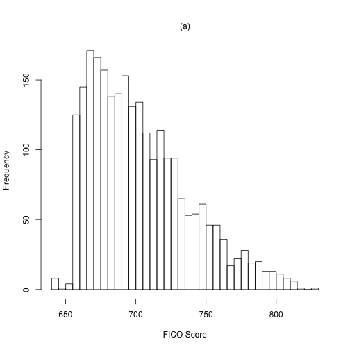
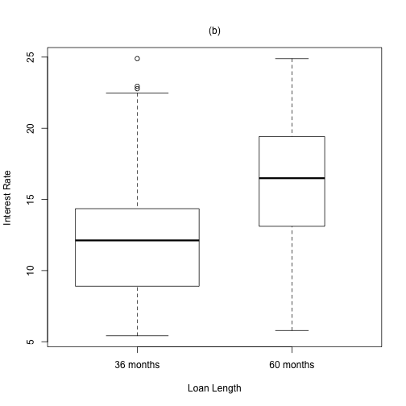
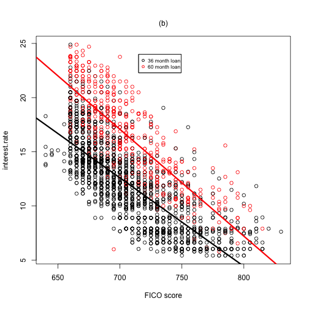

Final Loan Analysis
========================================================

Note: This analysis was created on a Mac. Some functions may be altered to be able to run on Windows machines.

------
This markdown file was created to accompany the final alaysis write up and allow anyone to reproduce the results therein. All the code for dowloading and transforming the data, performing exploratory analyses, and creating figures can be found here. 

## Preliminaries

### Download and load data into R, perform necccesary data transformations


```r
# Load Data
loan <- read.csv("../rawData/loansData.csv")

# Change column (variable) names
names(loan) <- tolower(names(loan))

# convert interest rate, to numeric class
loan$interest.rate <- as.numeric(sub("%", "", as.character(loan$interest.rate)))

# convert FICO score to numeric
loan$fico.range <- as.character(loan$fico.range)
loan$fico.range <- as.numeric(gsub("-[0-9]+", "", loan$fico.range))
```

-------
## Exploratory analysis

### Find number of missing values/check ranges

```r
sum(is.na(loan))
```

```
## [1] 7
```

```r
summary(loan)
```

```
##  amount.requested amount.funded.by.investors interest.rate  
##  Min.   : 1000    Min.   :    0              Min.   : 5.42  
##  1st Qu.: 6000    1st Qu.: 6000              1st Qu.:10.16  
##  Median :10000    Median :10000              Median :13.11  
##  Mean   :12406    Mean   :12002              Mean   :13.07  
##  3rd Qu.:17000    3rd Qu.:16000              3rd Qu.:15.80  
##  Max.   :35000    Max.   :35000              Max.   :24.89  
##                                                             
##     loan.length               loan.purpose  debt.to.income.ratio
##  36 months:1952   debt_consolidation:1307   0%     :   8        
##  60 months: 548   credit_card       : 444   12.54% :   6        
##                   other             : 201   12.20% :   5        
##                   home_improvement  : 152   12.85% :   5        
##                   major_purchase    : 101   14.22% :   5        
##                   small_business    :  87   14.66% :   5        
##                   (Other)           : 208   (Other):2466        
##      state       home.ownership monthly.income     fico.range 
##  CA     : 433   MORTGAGE:1148   Min.   :   588   Min.   :640  
##  NY     : 255   NONE    :   1   1st Qu.:  3500   1st Qu.:680  
##  TX     : 174   OTHER   :   5   Median :  5000   Median :700  
##  FL     : 169   OWN     : 200   Mean   :  5689   Mean   :706  
##  IL     : 101   RENT    :1146   3rd Qu.:  6800   3rd Qu.:725  
##  GA     :  98                   Max.   :102750   Max.   :830  
##  (Other):1270                   NA's   :1                     
##  open.credit.lines revolving.credit.balance inquiries.in.the.last.6.months
##  Min.   : 2.0      Min.   :     0           Min.   :0.000                 
##  1st Qu.: 7.0      1st Qu.:  5586           1st Qu.:0.000                 
##  Median : 9.0      Median : 10962           Median :0.000                 
##  Mean   :10.1      Mean   : 15245           Mean   :0.906                 
##  3rd Qu.:13.0      3rd Qu.: 18889           3rd Qu.:1.000                 
##  Max.   :38.0      Max.   :270800           Max.   :9.000                 
##  NA's   :2         NA's   :2                NA's   :2                     
##  employment.length
##  10+ years:653    
##  < 1 year :250    
##  2 years  :244    
##  3 years  :235    
##  5 years  :202    
##  4 years  :192    
##  (Other)  :724
```

All variables appear to be within normal ranges with the exception of monthly.income which has a max value of 102,750, potential outliers. 

### Look at distribution of FICO scores

```r
hist(loan$fico.range)
```

 

FICO scores appear to be right skewed with the majority of scores falling between 600 and 700.

### Look at distribution of interest rates

```r
hist(as.numeric(loan$interest.rate))
```

 

Appear evenly distributed but a large number of instances appearing in the 5- 10 range.

### Look at average FICO score per loan length

```r
plot(loan$fico.range ~ loan$loan.length)
```

 

No difference in mean between the two loan lengths.

## Modeling

### Look at FICO scores vs interest rates

```r
plot(loan$interest.rate ~ loan$fico.range)
```

 

Apparent relationship that is consistent with background knowledge.

### Look at FICO scores vs interest rates colored by loan length

```r
lm1 <- lm(loan$interest.rate ~ loan$fico.range + loan$loan.length + loan$fico.range * 
    loan$loan.length)
plot(loan$interest.rate ~ loan$fico.range, pch = 19)
points(loan$fico.range, loan$interest.rate, pch = 19, col = loan$loan.length)
```

 

Data is clearly grouped


## Get the estimates and confidence intervals


```r
## The estimate from summary
summary(lm1)
```

```
## 
## Call:
## lm(formula = loan$interest.rate ~ loan$fico.range + loan$loan.length + 
##     loan$fico.range * loan$loan.length)
## 
## Residuals:
##     Min      1Q  Median      3Q     Max 
## -11.561  -1.651  -0.218   1.411   9.318 
## 
## Coefficients:
##                                           Estimate Std. Error t value
## (Intercept)                               69.77730    1.04961   66.48
## loan$fico.range                           -0.08169    0.00149  -54.99
## loan$loan.length60 months                 16.31965    2.30708    7.07
## loan$fico.range:loan$loan.length60 months -0.01692    0.00326   -5.19
##                                           Pr(>|t|)    
## (Intercept)                                < 2e-16 ***
## loan$fico.range                            < 2e-16 ***
## loan$loan.length60 months                  2.0e-12 ***
## loan$fico.range:loan$loan.length60 months  2.3e-07 ***
## ---
## Signif. codes:  0 '***' 0.001 '**' 0.01 '*' 0.05 '.' 0.1 ' ' 1 
## 
## Residual standard error: 2.32 on 2496 degrees of freedom
## Multiple R-squared: 0.693,	Adjusted R-squared: 0.693 
## F-statistic: 1.88e+03 on 3 and 2496 DF,  p-value: <2e-16
```

```r

## The confidence interval from confine
confint(lm1)
```

```
##                                              2.5 %   97.5 %
## (Intercept)                               67.71911 71.83550
## loan$fico.range                           -0.08461 -0.07878
## loan$loan.length60 months                 11.79566 20.84363
## loan$fico.range:loan$loan.length60 months -0.02332 -0.01052
```

-------
## Figure Making

```r

# Histogram of FICO scores
hist(loan$fico.range, breaks = 30, xlab = "FICO Score", ylab = "Frequency", 
    main = "")
mtext(text = "(a)", side = 3, line = 1)
```

 

```r

# Boxplot of loan length vs interest rate
boxplot(loan$interest.rate ~ loan$loan.length, xlab = "Loan Length", ylab = "Interest Rate", 
    main = "", varwidth = TRUE)
mtext(text = "(b)", side = 3, line = 1)
```

 

```r

# plot of fico range and interest rate colored by loan length
plot(loan$fico.range, loan$interest.rate, col = loan$loan.length, xlab = "FICO score", 
    ylab = "interest.rate", main = "")
abline(c(lm1$coeff[1], lm1$coeff[2]), col = "black", lwd = 3)
abline(c(lm1$coeff[1] + lm1$coeff[3], lm1$coeff[2] + lm1$coeff[4]), col = "red", 
    lwd = 3)
legend(715, 24, legend = c("36 month loan", "60 month loan"), col = c("black", 
    "red"), pch = c(1, 1), cex = c(0.7, 0.7))
```

```
## Warning: the condition has length > 1 and only the first element will be
## used
```

```r
mtext(text = "(b)", side = 3, line = 1)
```

 

