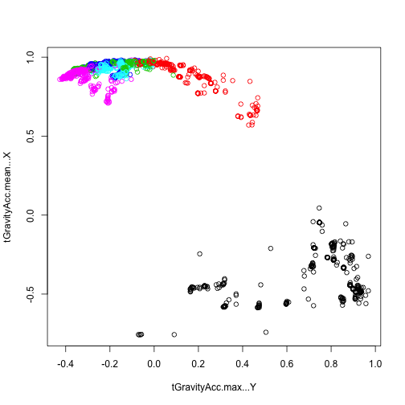
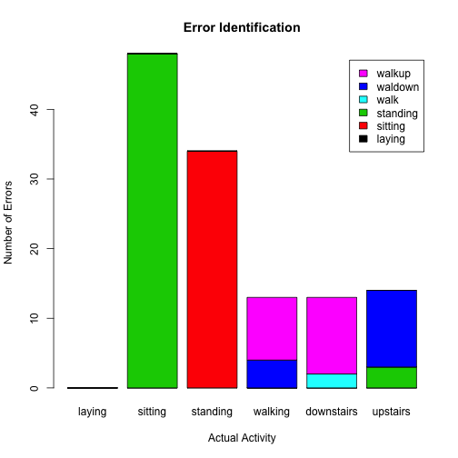

Final Activity Analysis
========================================================

Note: This analysis was created on a Mac. Some functions may be altered to be able to run on Windows machines.

-------
This markdown file was created to accompany the final alaysis write up and allow anyone to reproduce the results therein.

## Preliminaries

### Load the data and any required packages


```r
load("../rawData/samsungData.rda")
library(randomForest)
```

```
## randomForest 4.6-7
```

```
## Type rfNews() to see new features/changes/bug fixes.
```

```r
library(caret)
```

```
## Loading required package: cluster
```

```
## Loading required package: foreach
```

```
## Loading required package: lattice
```

```
## Loading required package: plyr
```

```
## Loading required package: reshape2
```


### Explore the data and perform necessary transformations


```r
# Check for missing values
sum(is.na(samsungData))
```

```
## [1] 0
```

```r
# Make sure column names are unique
length(unique(names(samsungData)))
```

```
## [1] 479
```

```r
# Create unique names
samsungData <- data.frame(samsungData)
# Change subject variable from numeric to factor
samsungData$subject <- as.factor(samsungData$subject)
# Change activity variable from character to factor
samsungData$activity <- as.factor(samsungData$activity)
```


No missing values, some columns were not unique. 

## Partition data into training, validation, and test sets.


```r
samsung_training <- subset(samsungData, subject == 1 | subject == 3 | subject == 
    5 | subject == 6 | subject == 7 | subject == 8)
samsung_training <- samsung_training[, c(1:561, 563)]
samsung_validation <- subset(samsungData, subject == 11 | subject == 14 | subject == 
    15 | subject == 16)
samsung_validation <- samsung_validation[, c(1:561, 563)]
samsung_test <- subset(samsungData, subject == 27 | subject == 28 | subject == 
    29 | subject == 30)
```


## Make a model and figures

### Create a model using randomForest and predict on test set


```r
samsung_forest <- randomForest(activity ~ ., data = samsung_training, prox = TRUE)
samsung_forest
```

```
## 
## Call:
##  randomForest(formula = activity ~ ., data = samsung_training,      prox = TRUE) 
##                Type of random forest: classification
##                      Number of trees: 500
## No. of variables tried at each split: 23
## 
##         OOB estimate of  error rate: 1.47%
## Confusion matrix:
##          laying sitting standing walk walkdown walkup class.error
## laying      327       0        0    0        0      0    0.000000
## sitting       0     280       12    0        0      0    0.041096
## standing      0      11      323    0        0      0    0.032934
## walk          0       0        0  369        0      2    0.005391
## walkdown      0       0        0    1      275      2    0.010791
## walkup        0       0        0    0        0    302    0.000000
```

```r
predictions <- predict(samsung_forest, samsung_test)
# calculate failure rate
(sum(predictions != samsung_test$activity)/(length(predictions))) * 100
```

```
## [1] 8.62
```


### Create Figures

```r

# Figure showing the important variables
important <- samsung_forest$importance
important <- important[order(important[, 1], decreasing = TRUE), ]
important <- as.matrix(important)
plot(samsung_training[, rownames(important)[1]], samsung_training[, rownames(important)[3]], 
    col = samsung_training$activity, xlab = rownames(important)[1], ylab = rownames(important)[3])
```

 

```r

# Figure visualizing the errors
percents <- data.frame(actual = c("laying", "sitting", "standing", "walk", "waldown", 
    "walkup"), `total mistakes` = c(0, 48, 34, 13, 12, 14), laying = c(0, 0, 
    0, 0, 0, 0), sitting = c(0, 0, 48, 0, 0, 0), standing = c(0, 34, 0, 0, 0, 
    0), walking = c(0, 0, 0, 0, 4, 9), downstairs = c(0, 0, 0, 2, 0, 11), upstairs = c(0, 
    0, 3, 0, 11, 0))
barplot(as.matrix(percents[, 3:8]), col = percents$actual, legend = percents$actual, 
    xlab = "Actual Activity", ylab = "Number of Errors", main = "Error Identification")
```

 

